# Сети в Linux

## Part 1. Инструмент ipcalc

### 1.1 Сети и маски

1. Адрес сети 192.167.38.54/13 \
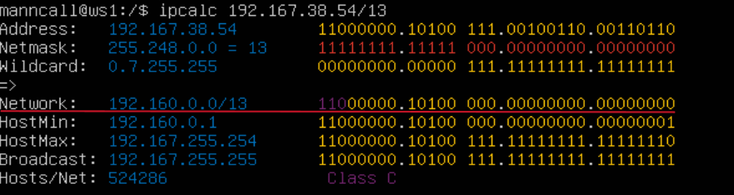 \
Адрес сети — **192.160.0.0**

2. Перевод маски 255.255.255.0 в префиксную и двоичную запись, /15 в обычную и двоичную, 11111111.11111111.11111111.11110000 в обычную и префиксную. \
Для перевода маски используем адрес 0.0.0.0, как тот на который нужно наложить маску

   - Перевод маски 255.255.255.0 в префиксную и двоичную запись \
   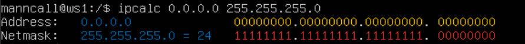 \
   Двоичная запись — **11111111.11111111.11111111.00000000** \
   Префикснаяя запись — **/24** 

   - Перевод /15 в обычную и двоичную \
   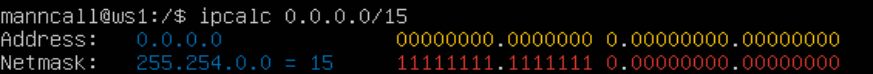 \
   Обычная запись — **255.254.0.0** \
   Двоичная запись — **11111111.11111110.00000000.00000000** 

   - Перевод 11111111.11111111.11111111.11110000 в обычную и префиксную \
   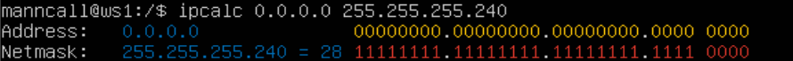 \
   Обычная запись — **255.255.255.240** \
   Префикснаяя запись — **/28** 

3. Минимальный и максимальный хост в сети 12.167.38.4 при масках: /8, 11111111.11111111.00000000.00000000, 255.255.254.0 и /4 
   - Минимальный и максимальный хост в сети 12.167.38.4 при маске /8 \
   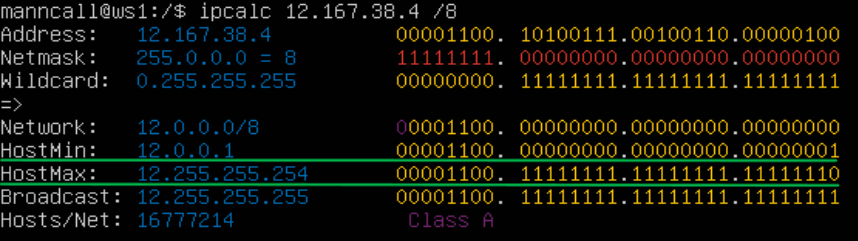 \
   Минимальный хост — **12.0.0.1** \
   Максимальный хост — **12.255.255.254**

   - Минимальный и максимальный хост в сети 12.167.38.4 при маске 11111111.11111111.00000000.00000000 \
   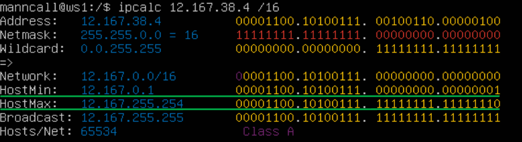 \
   Минимальный хост — **12.167.0.1** \
   Максимальный хост — **12.167.255.254**

    - Минимальный и максимальный хост в сети 12.167.38.4 при маске 255.255.254.0 \
   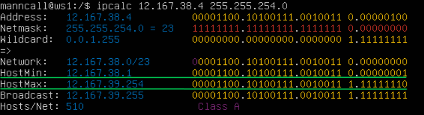 \
   Минимальный хост — **12.167.38.1** \
   Максимальный хост — **12.167.39.254**

   - Минимальный и максимальный хост в сети 12.167.38.4 при маске  /4 \
   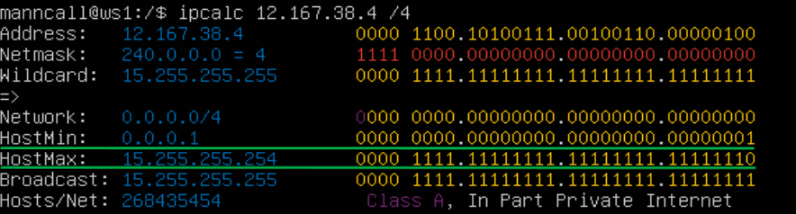 \
   Минимальный хост — **0.0.0.1** \
   Максимальный хост — **15.255.255.254**


### 1.2 localhost

- Определить и записать в отчёт, можно ли обратиться к приложению, работающему на localhost, со следующими IP: 194.34.23.100, 127.0.0.2, 127.1.0.1, 128.0.0.1 

  - Проверим  IP-адрес, связанный с localhost \
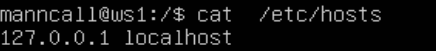 

   Любой адрес в диапазоне от 127.0.0.1 до 127.255.255.254 может использоваться как loopback-адрес. \
 **loopback** - локальная петлевая связь.

1. **194.34.23.100** - **нельзя** обратиться к приложению
2. **127.0.0.2** - **можно** обратиться к приложению
3. **127.1.0.1** - **можно** обратиться к приложению
4. **128.0.0.1** - **нельзя** обратиться к приложению


### 1.3 Диапазоны и сегменты сетей

1. Определим какие из перечисленных IP можно использовать в качестве публичного, а какие только в качестве частных: 10.0.0.45, 134.43.0.2, 192.168.4.2, 172.20.250.4, 172.0.2.1, 192.172.0.1, 172.68.0.2, 172.16.255.255, 10.10.10.10, 192.169.168.1 

   Существуют три основных диапазона частных IP-адресов, которые зарезервированы для использования в частных сетях:
   1. **10.0.0.1 – 10.255.255.254**  (диапазон /8) 
   2. **172.16.0.1 – 172.31.255.254**  (диапазон /12) 
   3. **192.168.0.1 – 192.168.255.254**  (диапазон /16) 

   На основе этой информации определим какие ip-адреса публичные, а какие частные: \
   **10.0.0.45** — частный \
   **134.43.0.2** — публичный \
   **192.168.4.2** — частный \
   **172.20.250.4** — частный \
   **172.0.2.1** — публичный \
   **192.172.0.1** — публичный \
   **172.68.0.2** — публичный \
   **172.16.255.255** — частный \
   **10.10.10.10** — частный \
   **192.169.168.1** — публичный

2. Какие из перечисленных IP-адресов шлюза возможны у сети 10.10.0.0/18: 10.0.0.1, 10.10.0.2, 10.10.10.10, 10.10.100.1, 10.10.1.255

   Диапазон адресов для сети **10.10.0.0/18** следующий: \
   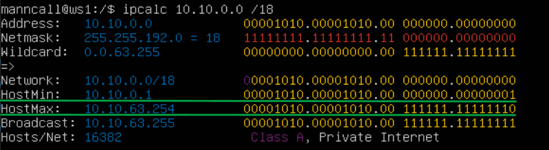 \
   **Минимальный адрес: 10.10.0.1** \
   **Максимальный адрес: 10.10.63.254**
   
   **10.0.0.1** — не попадает в диапазон \
   **10.10.0.2** — IP шлюза возможен \
   **10.10.10.10** — IP шлюза возможен \
   **10.10.100.1** — не попадает в диапазон \
   **10.10.1.255** — IP шлюза возможен


## Part 2. Статическая маршрутизация между двумя машинами

- Вызываем `ip a` у **ws1**: \
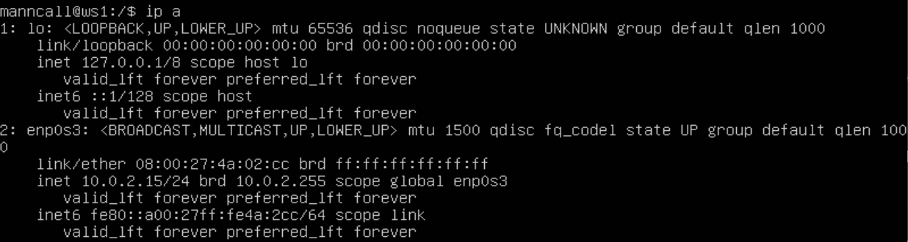 

- Вызываем `ip a` у **ws2**: \
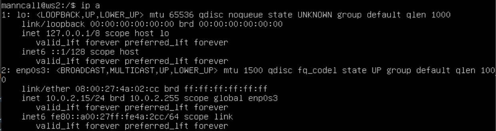 


- Опишем сетевой интерфейс, соответствующий внутренней сети, на обеих машинах и зададим следующие адреса и маски: ws1 — 192.168.100.10, маска /16, ws2 — 172.24.116.8, маска /12.

  - Опишем сетевой интерфейс у **ws1**: \
    

    Выполним команду `netplan apply` для перезапуска сервиса сети. И проверим измененные данные `ip a` у **ws1**: \
   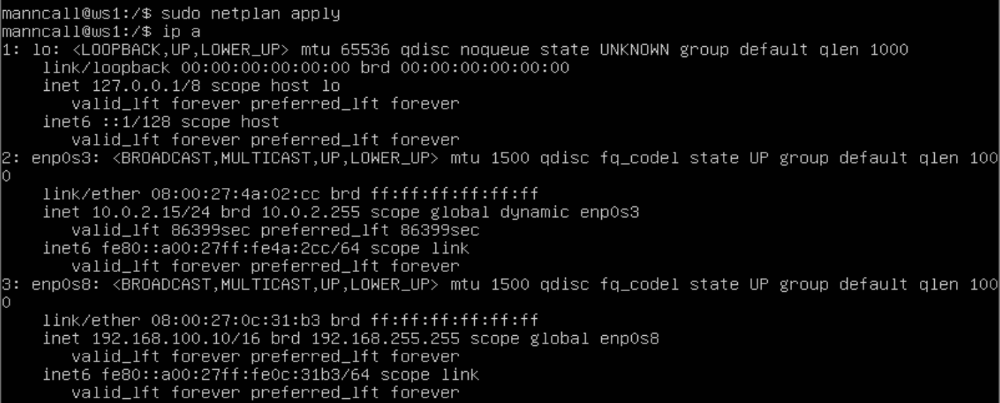 

  - Опишем сетевой интерфейс у **ws2**: \
   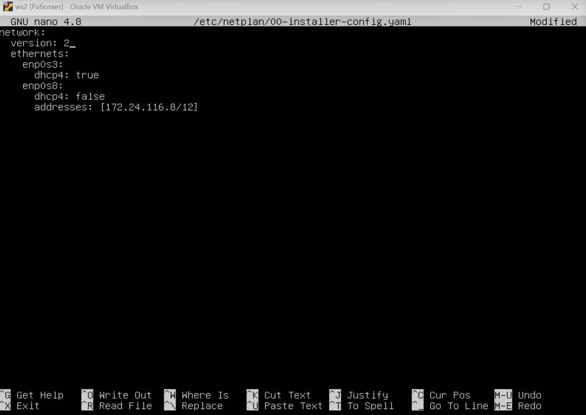 

    Выполним команду `netplan apply` для перезапуска сервиса сети. И проверим измененные данные `ip a` у **ws2**: \
   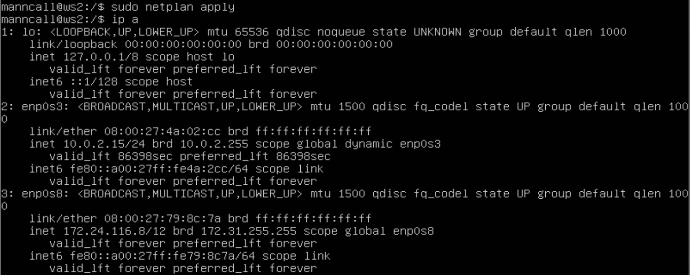 


### 2.1 Добавление статического маршрута вручную

 - Добавим статический маршрут от одной машины до другой и обратно при помощи команды вида `ip r add`.

    - От ws1 к ws2: \
     

    - От ws1 к ws2: \
     

- Пропингуем соединение между машинами.
  - ping c ws1 -> ws2: \
  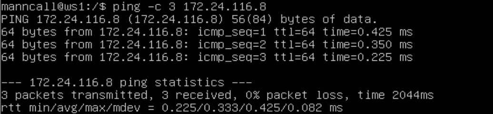 

  - ping c ws2 -> ws1: \
  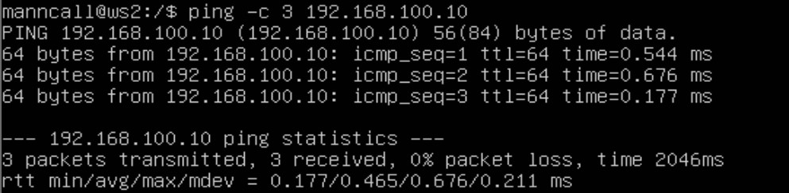 


### 2.2. Добавление статического маршрута с сохранением

- Добавим статический маршрут от одной машины до другой с помощью файла /etc/netplan/00-installer-config.yaml. 
  - В ws1: \
   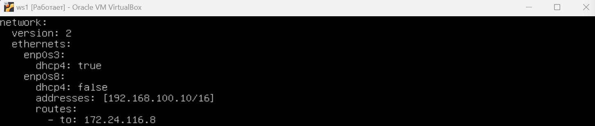 

  - В ws2: \
   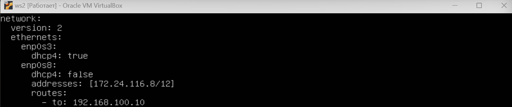 

- Примем конфигурацию netplan командой `sudo netplan apply` 

- Пропингуем соединение между машинами.
  - ping c ws1 -> ws2: \
  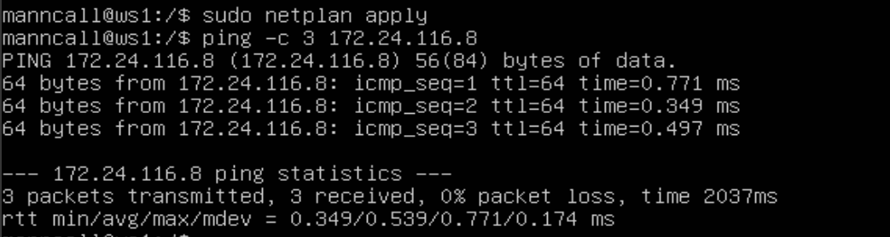 

  - ping c ws2 -> ws1: \
  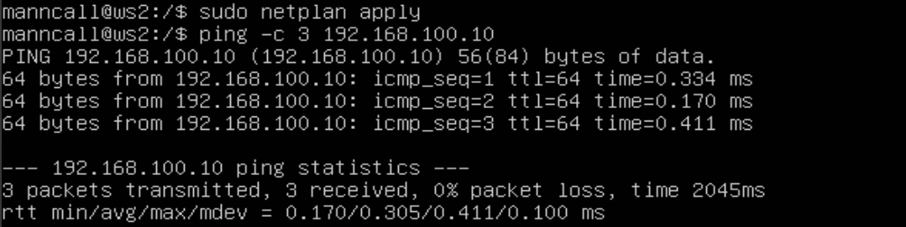 


## Part 3. Утилита iperf3

### 3.1. Скорость соединения

- 8 Mbps (мегабит в секунду) в MB/s (мегабайт в секунду): \
   1 мегабайт (MB) = 8 мегабит (Mb). \
   Следовательно, 8 Mbps = 8 / 8 = 1 MB/s. 

   **8 Mbps = 1 MB/s**

- 100 MB/s (мегабайт в секунду) в Kbps (килобит в секунду): \
  1 мегабайт (MB) = 8 * 1024 килобит (Kb). \
  Следовательно, 100 MB/s = 100 * 8 * 1024 = 819200 Kbps. 

  **100 MB/s = 819200 Kbps**
  
- 1 Gbps (гигабит в секунду) в Mbps (мегабит в секунду): \
  1 гигабит (Gb) = 1024 мегабит (Mb). \
  Следовательно, 1 Gbps = 1024 Mbps.

  **1 Gbps = 1024 Mbps**


### 3.2. Утилита iperf3

- Устанавливаем утилиту iperf3 командой `sudo apt install iperf3` на обе машины. На скрине для примера установка на ws1 \
 

- Запустим iperf3 в режиме сервера на ws1: \
  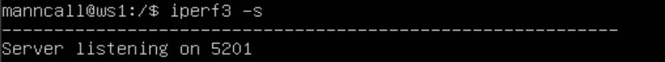 

- На другой машине (ws2) запуститим iperf3 в режиме клиента, указав IP-адрес сервера (ws1): \
  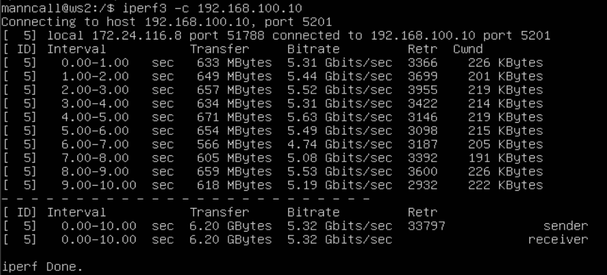 \
  вывод на ws1: \
  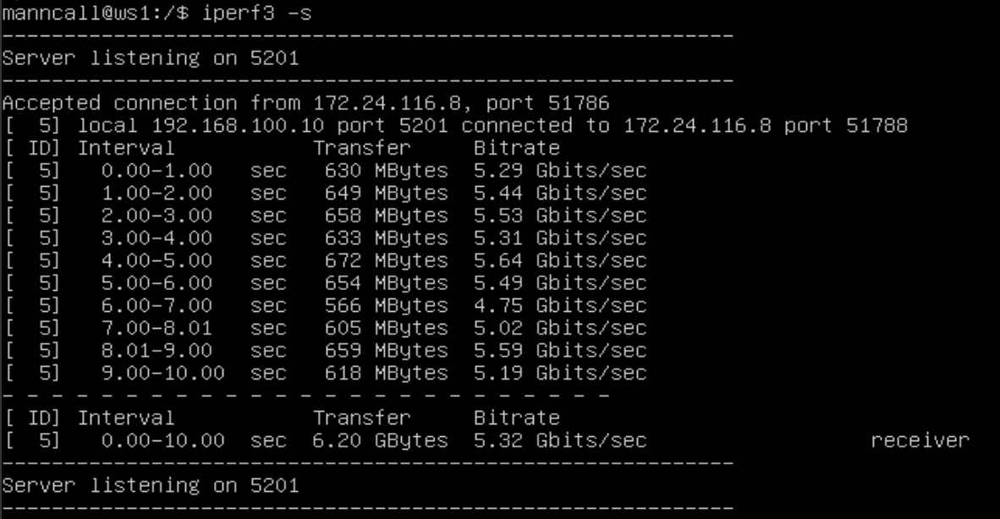


## Part 4. Сетевой экран


### 4.1. Утилита iptables

#### Задание: 

 - Создать файл /etc/firewall.sh, имитирующий файрвол, на ws1 и ws2:

```shell
#!/bin/sh

# Удаление всех правил в таблице «filter» (по умолчанию).
iptables -F
iptables -X
```


- Нужно добавить в файл подряд следующие правила:

  1) На ws1 примени стратегию, когда в начале пишется запрещающее правило, а в конце пишется разрешающее правило (это касается пунктов 4 и 5).

  2) На ws2 примени стратегию, когда в начале пишется разрешающее правило, а в конце пишется запрещающее правило (это касается пунктов 4 и 5).

  3) Открой на машинах доступ для порта 22 (ssh) и порта 80 (http).

  4) Запрети echo reply (машина не должна «пинговаться», т. е. должна быть блокировка на OUTPUT).

  5) Разреши echo reply (машина должна «пинговаться»).

#### Выполнение: 
  - Содержание файла /etc/firewall для ws1: \
  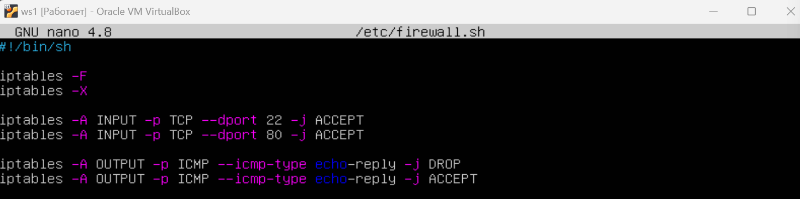

  - Содержание файла /etc/firewall для ws2: \
  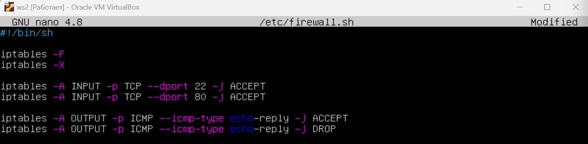


- Запустим файлы на обеих машинах командами `chmod +x /etc/firewall.sh` и `/etc/firewall.sh`

  - ws1 c командами `chmod +x /etc/firewall.sh` и `/etc/firewall.sh` \


  - ws2 c командами `chmod +x /etc/firewall.sh` и `/etc/firewall.sh` \


 - **Разница в стратегиях** в том, что срабатывает первое написанное правило. В нашем случае первое правило у ws2 разрешает отвечать на пинг запросы, а запрещающее правило написанное после не срабатывает. Первое правило имеет приоритет, аналогично в ws1, где первым идет запрещающее правило из-за которого мы не получим ответ на пинг.

 ### 4.2. Утилита nmap

- Командой `ping` найдем машину, которая не «пингуется»:
  - ping c ws1 -> ws2: \
  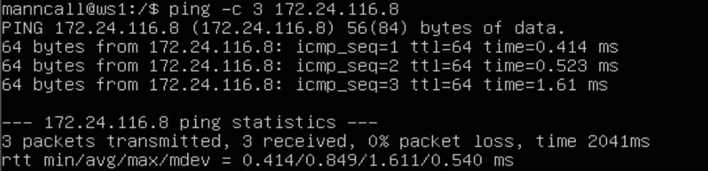 

  - ping c ws2 -> ws1: (не удается пинговать ws1)\
  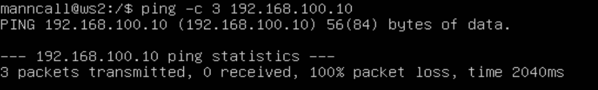 


- Утилитой `nmap` покажем, что хост машины ws1 запущен:
 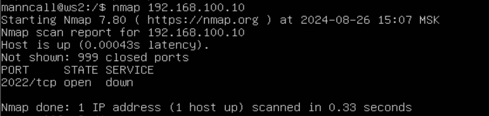 

- Сохраним дампы виртуальных машин

## Part 5. Статическая маршрутизация сети

- Поднимем пять виртуальных машин (3 рабочие станции (ws11, ws21, ws22) и 2 роутера (r1, r2)). \
  

 ### 5.1. Настройка адресов машин

 Рисунок сети:
 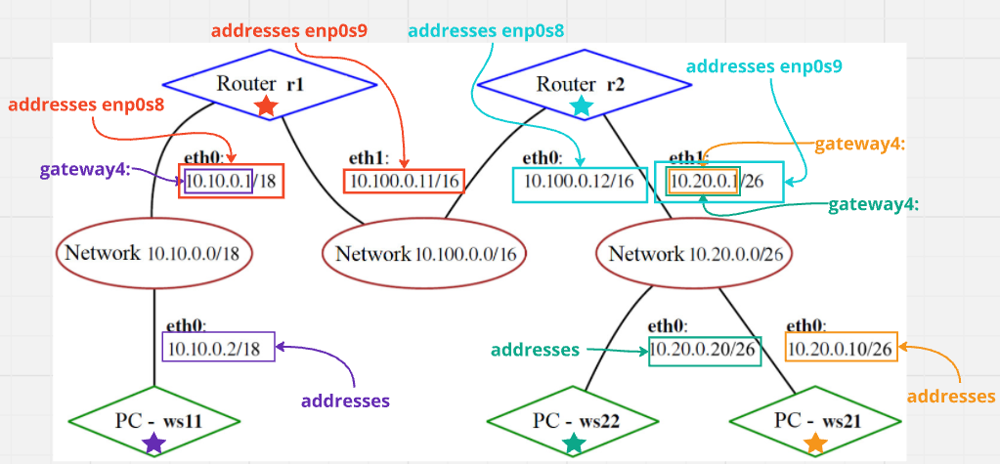 

- Настроим конфигурации машин в etc/netplan/00-installer-config.yaml согласно сети на рисунке
  1. Для роутеров:
      - r1: \
      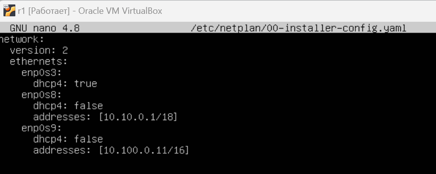 
      - r2: \
      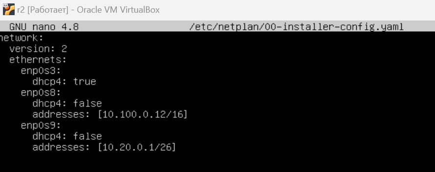
  1. Для рабочих станций:
      - ws11 \
      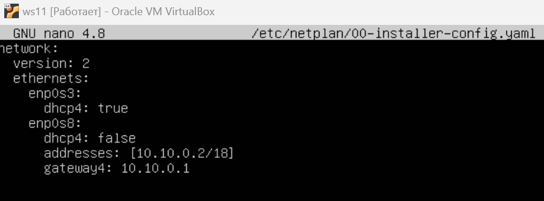 
      - ws21 \
      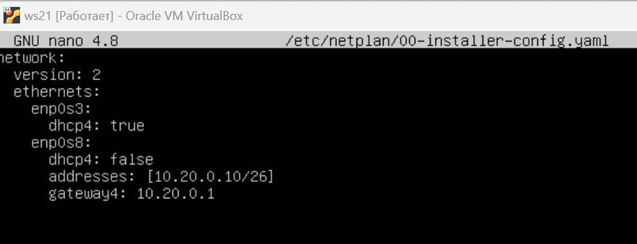 
      - ws22 \
      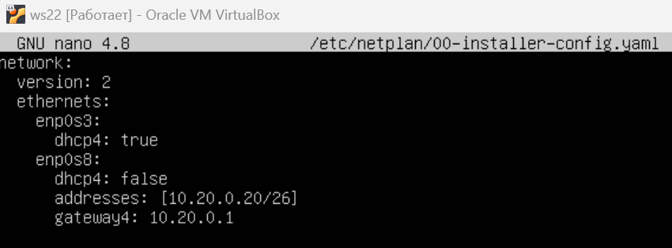 


- Перезапустим сервис сети, у каждой машины, командой `sudo netplan apply`. Командой `ip -4 a` проверим, что адрес машины задан верно.
  - r1 \
  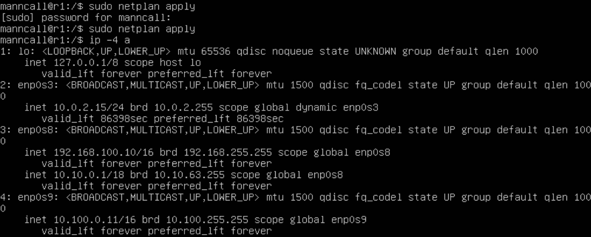 

  - r2: \
  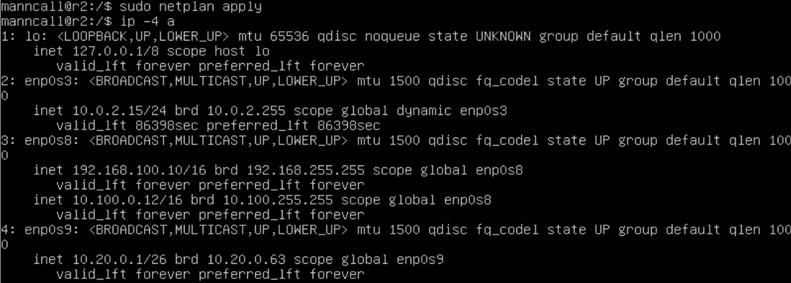

  - ws11 \
  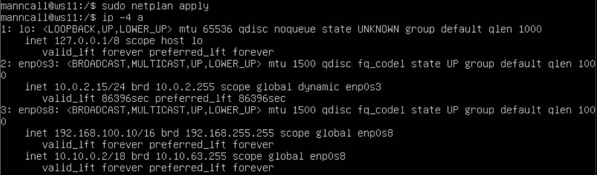 

  - ws21 \
  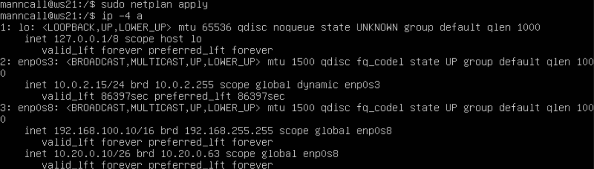 

  - ws22 \
  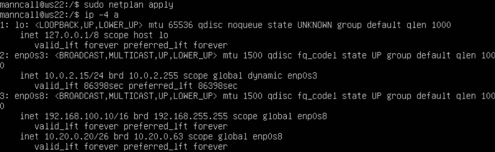 
  

- Также пропингуем ws22 с ws21. Аналогично пропингуем r1 с ws11.
  1. ping ws21 -> ws22 \
  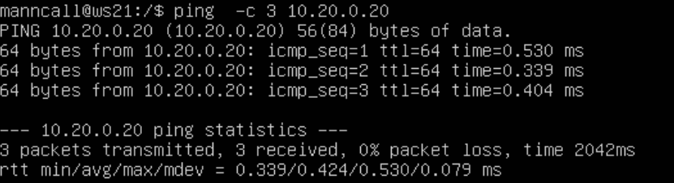 
  2. ping ws11 -> r1 \
  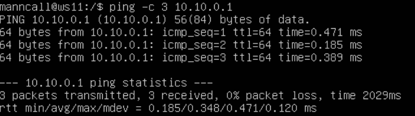 


### 5.2. Включение переадресации IP-адресов

 - Для включения переадресации IP выполним команду на роутерах:
`sysctl -w net.ipv4.ip_forward=1`:
    - переадресации IP r1: \
    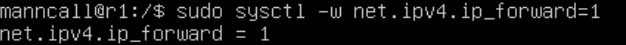 

    - переадресации IP r2: \
    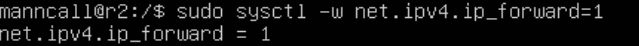 

- Откроем файл /etc/sysctl.conf и добавим в него следующую строку:
`net.ipv4.ip_forward = 1` . \
*При использовании этого подхода, IP-переадресация включена на постоянной основе.*
   - постоянная переадресации IP r1: \
    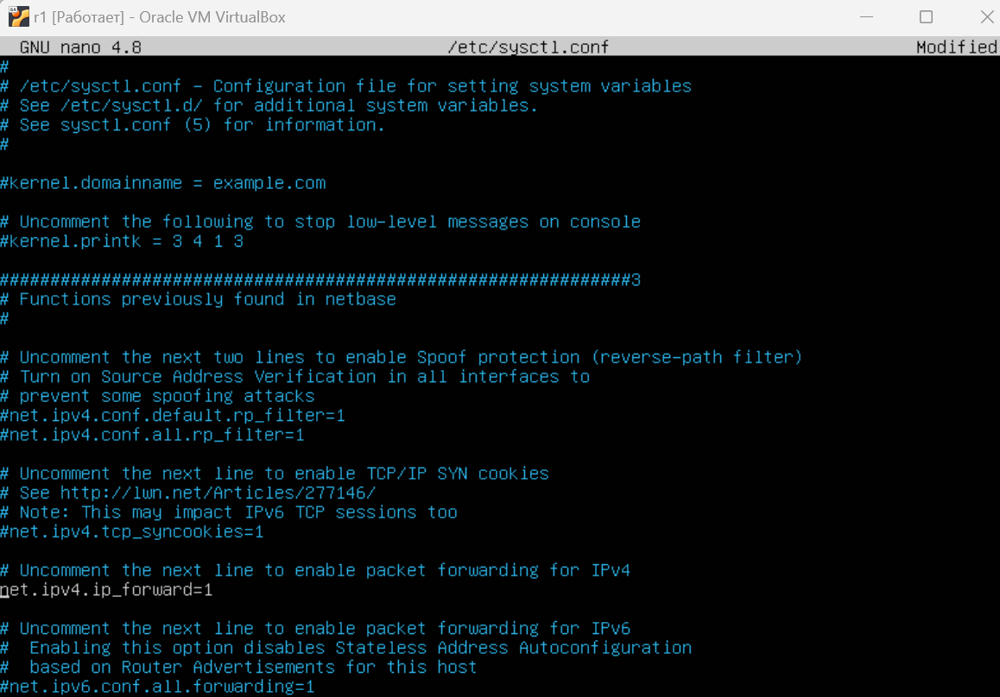 

    - постоянная переадресации IP r2: \
    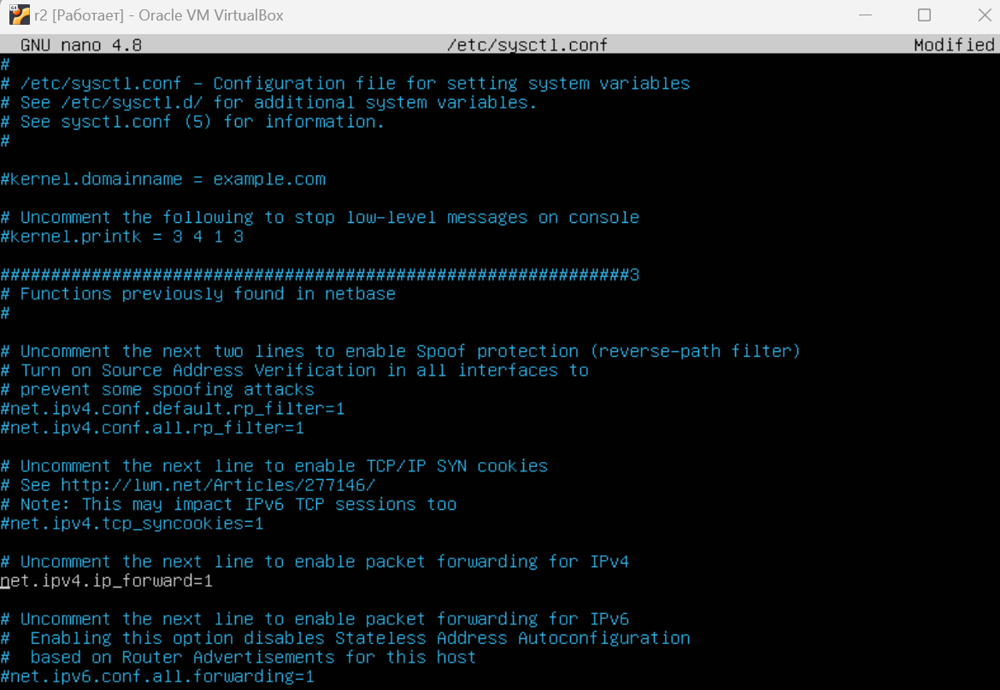 


### 5.3. Установка маршрута по умолчанию

- Настроим маршрут по умолчанию (шлюз) для рабочих станций. Для этого добавим default перед IP-роутера в файле конфигураций
  - netplan ws11: \
  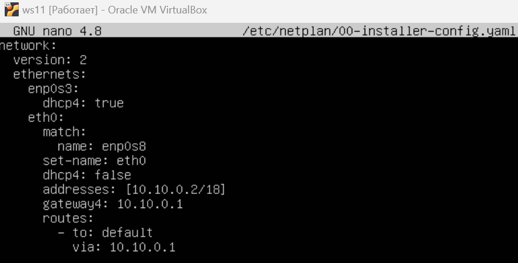 

  - netplan ws21 \
  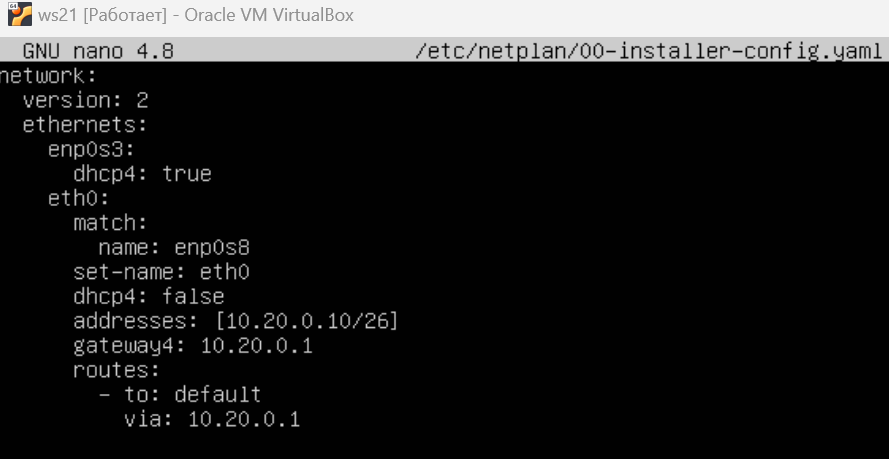 

  - netplan ws22 \
  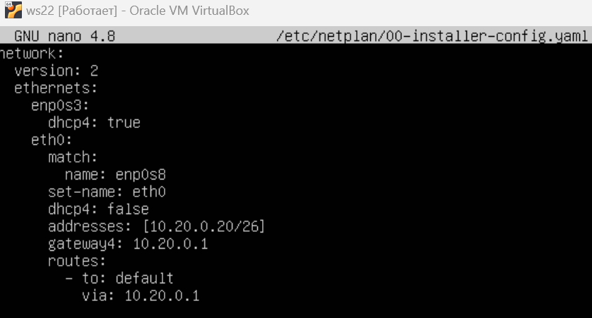 

- Вызовем `ip r` и покажем, что добавился маршрут в таблицу маршрутизации.
  - `ip r` ws11: \
  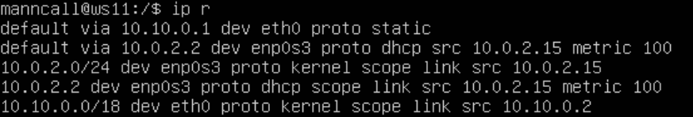 

  - `ip r` ws21 \
  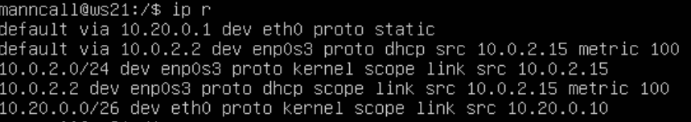 

  - `ip r` ws22 \
  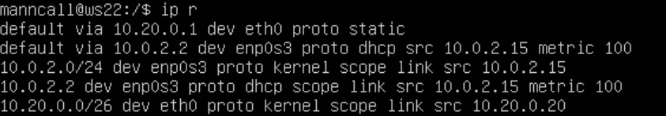 

- Пропингуем с ws11 роутер r2 и покажем на r2, что пинг доходит. Для этого используем команду: `tcpdump -tn -i eth0`

  1. ping ws11 -> r2 \
  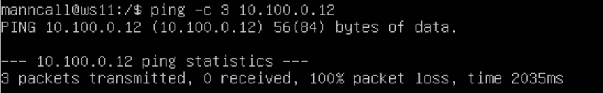

  2. `tcpdump -tn -i eth0` на r2: \
  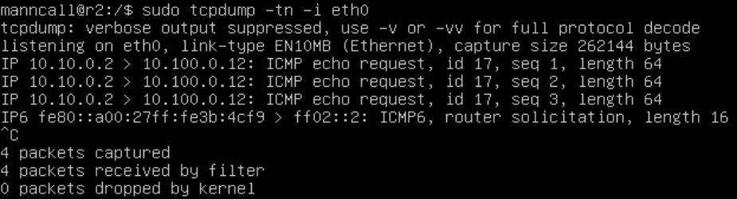

  Из скринов видно, что пинг доходит, но нет ответа.


### 5.4. Добавление статических маршрутов

- Добавим в роутеры r1 и r2 статические маршруты в файле конфигураций. Пример для r1 маршрута в сетку 10.20.0.0/26:


  ``` shell
  # Добавим в конец описания сетевого интерфейса eth1:
  - to: 10.20.0.0
    via: 10.100.0.12
  ```
  - netplan r1: \
  

  - netplan r2: \
  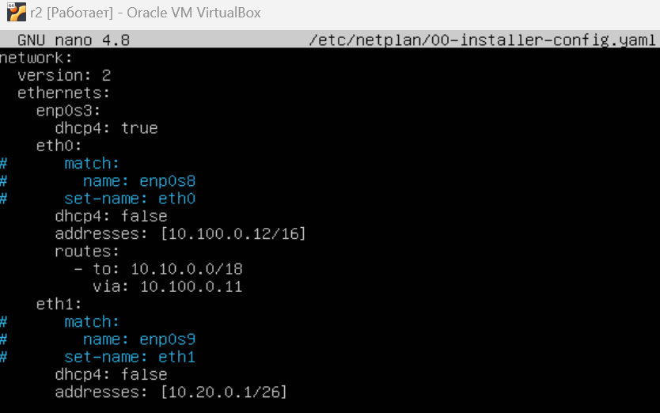


- Вызовем `ip r` и покажем таблицы с маршрутами на обоих роутерах.  \
   Пример таблицы на r1:
  ```
  10.100.0.0/16 dev eth1 proto kernel scope link src 10.100.0.11
  10.20.0.0/26 via 10.100.0.12 dev eth1
  10.10.0.0/18 dev eth0 proto kernel scope link src 10.10.0.1
  ```

 - Вызов `ip r` на r2: \
 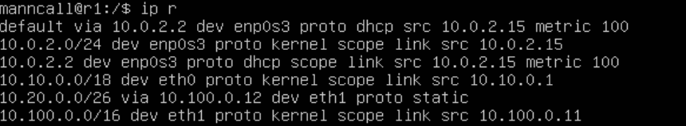

 - Вызов `ip r` на r1: \
 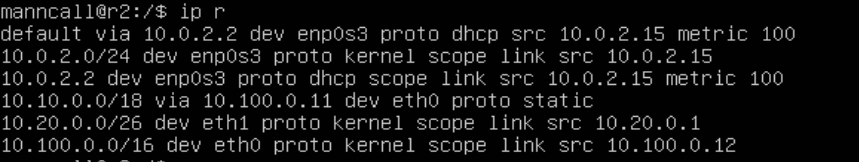

- Запустим команды на ws11:\
`ip r list 10.10.0.0/[маска сети]` и `ip r list 0.0.0.0/0` \
  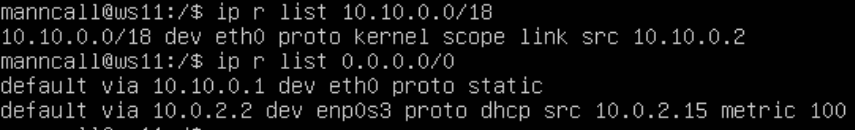

- Маршруты с более конкретными префиксами (длинными масками сети) имеют приоритет над более общими маршрутами. Когда Linux определяет маршрут для IP-адреса, он сначала пытается найти самый конкретный маршрут (с самой длинной маской сети). \
 Для IP-адресов, которые подпадают под более конкретные маршруты (такие как 10.10.0.0/18), всегда выбирается этот маршрут, а не маршрут по умолчанию (0.0.0.0/0).


### 5.5. Построение списка маршрутизаторов

- Запустим на r1 команду дампа: `tcpdump -tnv -i eth0`
  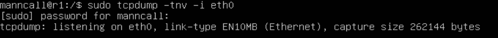

  Вывод команды: \
  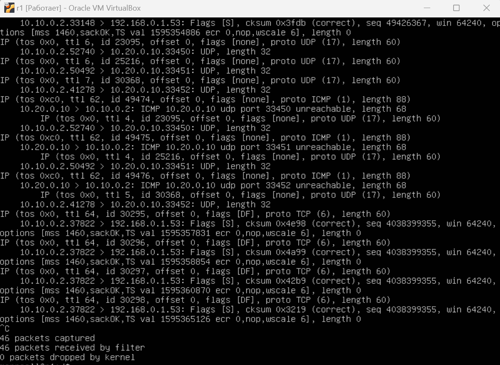

- При помощи утилиты `traceroute` построим список маршрутизаторов на пути от ws11 до ws21. \
  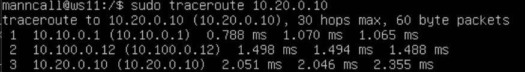

- Утилита `traceroute` отправляет последовательность пакетов с постепенно увеличивающимся значением поля "Time To Live" (TTL) в заголовке IP. Каждый маршрутизатор на пути уменьшает TTL на единицу, и если TTL достигает нуля, маршрутизатор отбрасывает пакет и отправляет ICMP-сообщение "Time Exceeded" обратно к отправителю. Так traceroute получает информацию о каждом промежуточном узле на пути к конечному хосту. 

  **Анализ дампа на r1** \
На предоставленном скриншоте видно, что tcpdump на маршрутизаторе r1 перехватывает различные пакеты, включая те, которые связаны с запросами ICMP и UDP от утилиты traceroute.

  `unreachable` - эти сообщения возникают, когда маршрутизатор на пути не может доставить пакет к конечному пункту назначения, либо из-за того, что TTL пакета истек, либо из-за того, что целевой порт недоступен. \
  Эти сообщения отправляются обратно к отправителю, и traceroute регистрирует IP-адрес маршрутизатора, который отправил это сообщение, как один из узлов на пути.

  Эти данные позволяют нам увидеть, какие маршрутизаторы находятся на пути между нашим компьютером и удаленным хостом, и какие узлы отвечают за пересылку трафика на данном маршруте.

  **Пакеты сначала проходят через маршрутизатор r1 (IP 10.10.0.1), затем через r2 (IP 10.100.0.12), и, наконец, достигают ws21 (IP 10.20.0.10).**


### 5.6. Использование протокола ICMP при маршрутизации

- Запустим на r1 перехват сетевого трафика, проходящего через eth0 с помощью команды: `tcpdump -n -i eth0 icmp` \


- Пропингуем с ws11 несуществующий IP (например, 10.30.0.111) с помощью команды: `ping -c 1 10.30.0.111` \
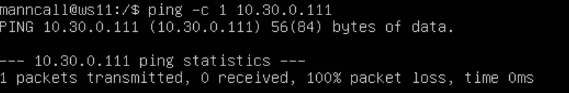


## Part 6. Динамическая настройка IP с помощью DHCP

- Для r2 настроим в файле /etc/dhcp/dhcpd.conf конфигурацию службы DHCP:

1) Укажем адрес маршрутизатора по умолчанию, DNS-сервер и адрес внутренней сети. Пример файла для r2:

   ``` shell
   subnet 10.100.0.0 netmask 255.255.0.0 {}

   subnet 10.20.0.0 netmask 255.255.255.192
   {
     range 10.20.0.2 10.20.0.50;
     option routers 10.20.0.1;
     option domain-name-servers 10.20.0.1;
   }
   ```

   Для r2 настраиваем конфигурацию службы DHCP \
   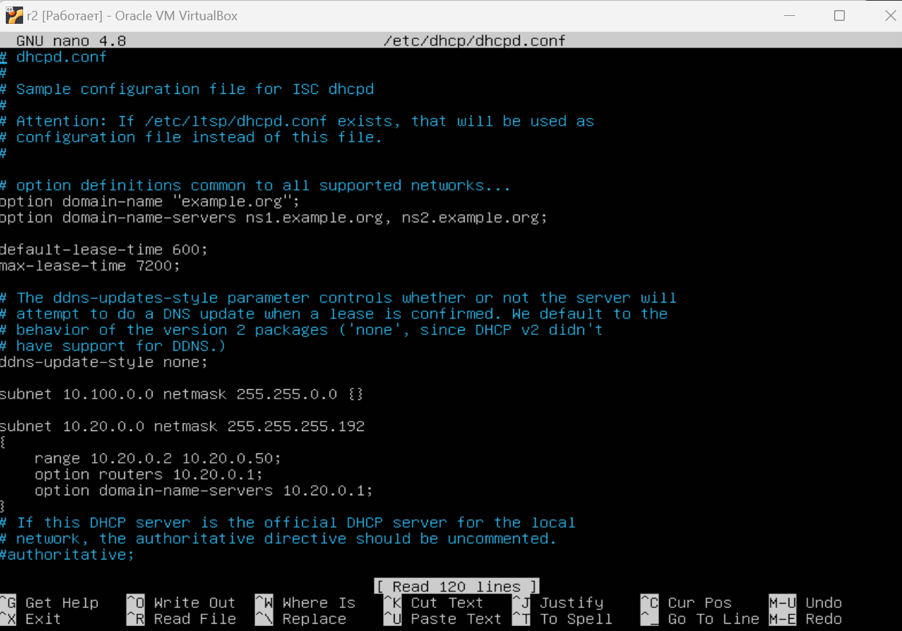

2) В файле resolv.conf (у r2) пропишем nameserver 8.8.8.8 \
    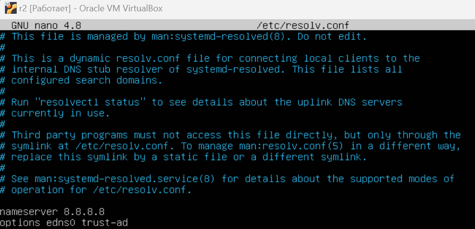

- Перезагрузим службу DHCP командой `systemctl restart isc-dhcp-server`. Машину ws21 перезагрузим при помощи `reboot` и через `ip a` покажем, что она получила адрес. Также пропингуем ws22 с ws21.

  1. Перезагрузим службу DHCP командой `systemctl restart isc-dhcp-server` \
  

  2. Машину ws21 перезагрузим при помощи `reboot` \
  

  3. Через `ip a` покажем, что ws21 получила адрес \
  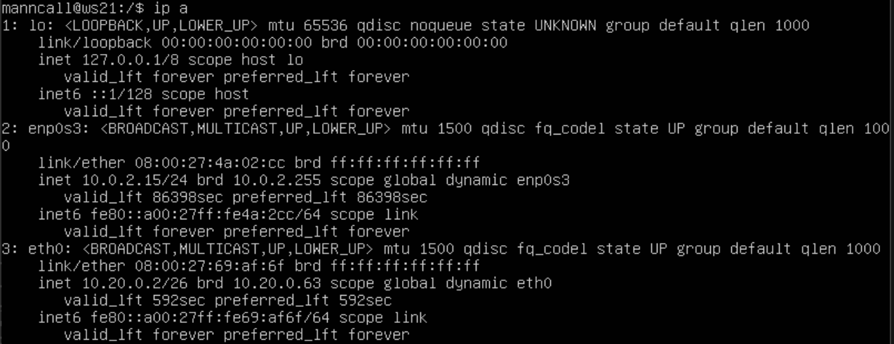

  4. ping ws21 -> ws22 \
  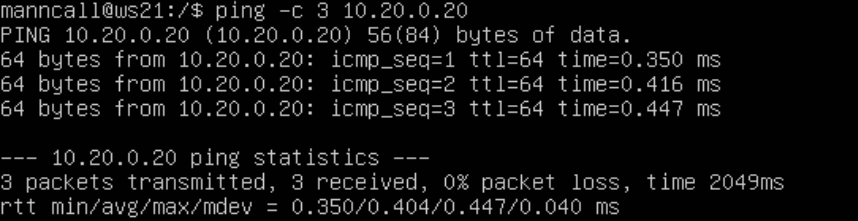

- Укажем MAC-адрес у ws11, для этого в etc/netplan/00-installer-config.yaml надо добавить строки: macaddress: 10:10:10:10:10:BA, dhcp4: true. \
  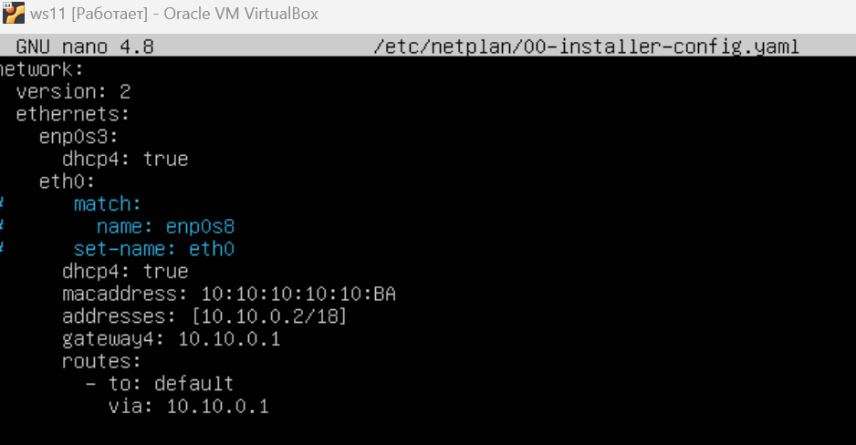

- Для r1 настроим аналогично r2, но сделаем выдачу адресов с жесткой привязкой к MAC-адресу (ws11)
  1. Для r1 настраиваем конфигурацию службы DHCP \
   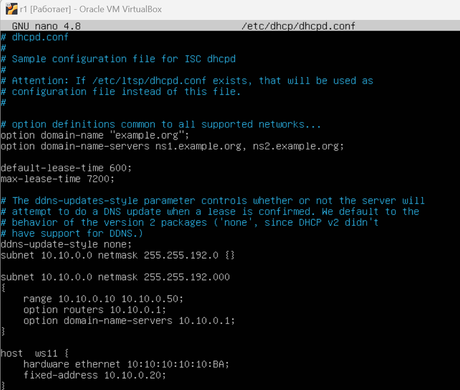

  2. В файле resolv.conf (у r1) пропишем nameserver 8.8.8.8 \
    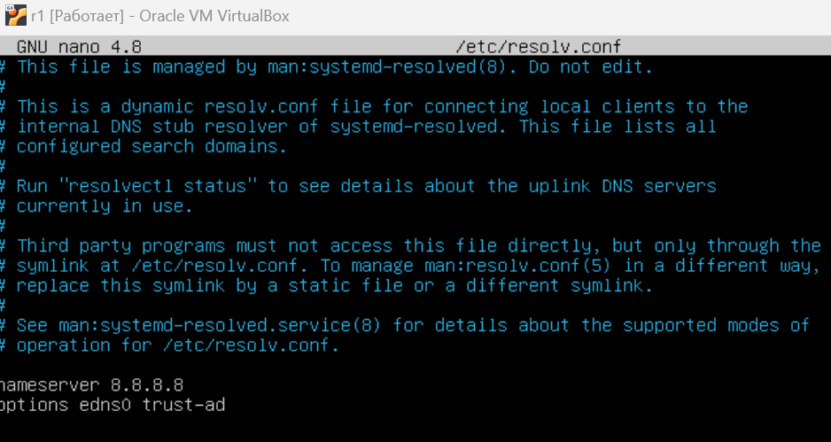
 
  2. Перезагрузим службу DHCP командой `systemctl restart isc-dhcp-server` \
  

  3. Машину ws11 перезагрузим при помощи `reboot` \
  

  4. Через `ip a` покажем, что ws11 получила адрес \
  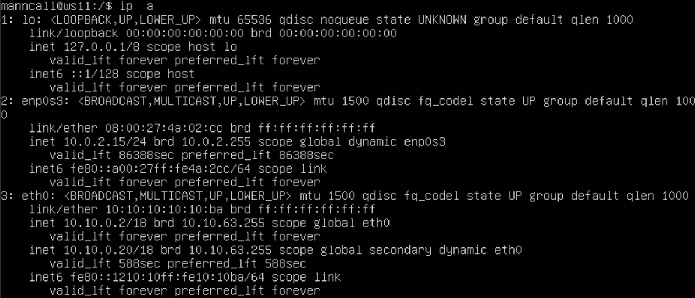

  5. ping ws11 -> ws22 \
  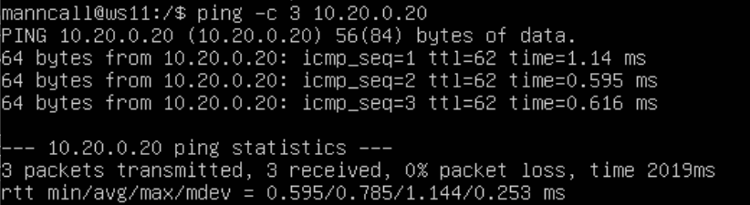

- Запросим с ws21 обновление IP-адреса
  - До обновления ip: \
  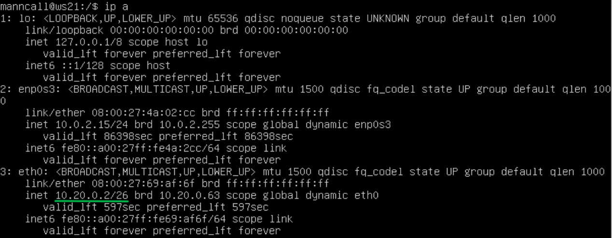

  - После обновления ip: \
  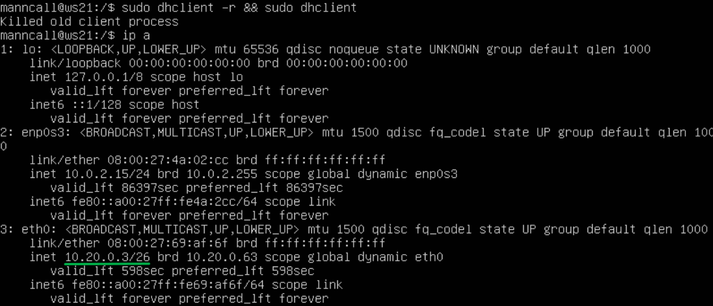


  Использованные опции DHCP сервера: 
  1. range 10.20.0.2 10.20.0.50; - Задает диапазон IP-адресов, которые DHCP-сервер может выдать клиентам. 
  2. option routers: Задает шлюз по умолчанию, который будет использоваться клиентом для выхода в другие сети. 
  3. option domain-name-servers: Указывает DNS-серверы, которые будут использоваться клиентом для разрешения доменных имен. В вашем случае:

  Эти опции позволили ws21 получить новый IP-адрес, а также настройки шлюза и DNS-сервера от DHCP-сервера на маршрутизаторе r2.

  Используемые команды: 
    1. `sudo dhclient -r` - освобожждаем место для нового адреса
    2. `sudo dhclient` - запрашиваем новый адрес

- Сохраняем дампы образов виртуальных машин


## Part 7. NAT


- В файле /etc/apache2/ports.conf на ws22 и r1 изменим строку Listen 80 на Listen 0.0.0.0:80, то есть сделаем сервер Apache2 общедоступным.
  - /etc/apache2/ports.conf на r1 \
  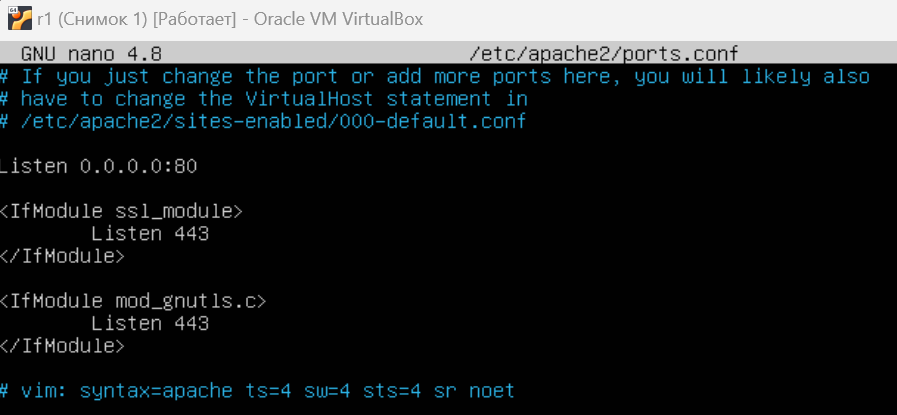

  - /etc/apache2/ports.conf на ws22 \
  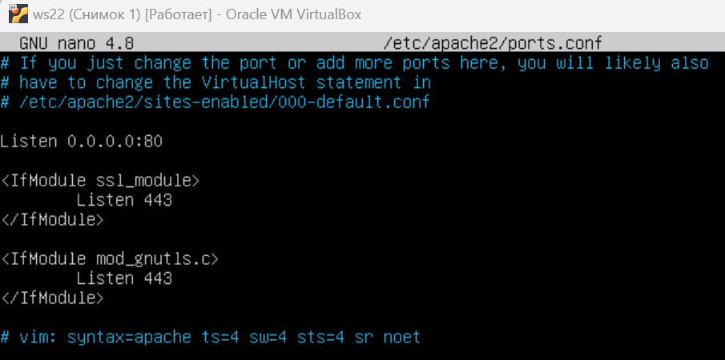

- Запустим веб-сервер Apache командой `service apache2 start` на ws22 и r1
  - Запуск Apache на ws22: \
  

  - Запуск Apache на r1: \
  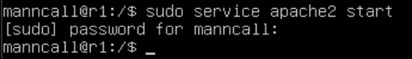

- Добавим в фаервол, созданный по аналогии с фаерволом из Части 4, на r2 следующие правила:
  1) Удаление правил в таблице filter — iptables -F;
  2) Удаление правил в таблице «NAT» — iptables -F -t nat;
  3) Отбрасывать все маршрутизируемые пакеты — iptables --policy FORWARD DROP. 

  *При запуске файла с этими правилами, ws22 не должна «пинговаться» с r1.*

    - Файл /etc/firewall.sh на r2: \
     

    - Запустим фаервол командами: `chmod +x /etc/firewall.sh` и `/etc/firewall.sh` \
      

  - Проверим соединение между ws22 и r1 командой ping. (ping r1 -> ws22)
  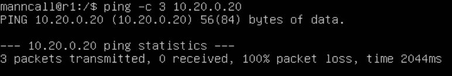
  
  
- Добавим в файл ещё одно правило: 

  4. Разрешить маршрутизацию всех пакетов протокола ICMP.

  Запустим файл также, как в Части 4.

  Проверим соединение между ws22 и r1 командой ping. \
  *При запуске файла с этими правилами, ws22 должна «пинговаться» с r1*

  - Файл /etc/firewall.sh на r2 с добавленым новым правилом: \
     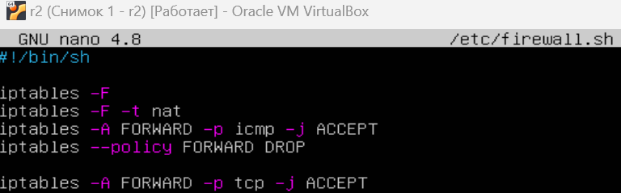
 
  - Запустим файл командами: `chmod +x /etc/firewall.sh` и `/etc/firewall.sh` \
      

  - Проверим соединение между ws22 и r1 командой ping. (ping r1 -> ws22)
  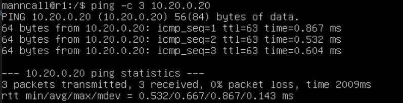
  
- Добавим еще два правила 

  5) Включи SNAT, а именно маскирование всех локальных IPиз локальной сети, находящейся за r2 (по обозначениям из Части 5 — сеть 10.20.0.0).

  6) Включи DNAT на 8080 порт машины r2 и добавить к веб-серверу Apache, запущенному на ws22, доступ извне сети.

  - Файл /etc/firewall.sh на r2 \
     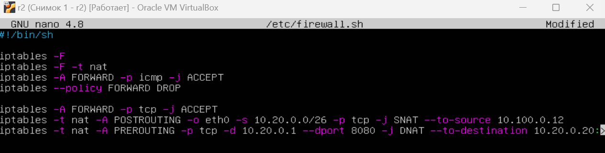
    
  - Запустим файл: \
  

*Перед тестированием рекомендуется отключить сетевой интерфейс NAT (его наличие можно проверить командой ip a) в VirtualBox, если он включен.*


- Проверим соединение по TCP для SNAT: для этого с ws22 подключиться к серверу Apache на r1 командой: `telnet 10.10.0.1 80`: \
  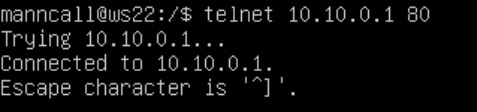

  И доп. проверка `telnet 10.100.0.11 80` \
  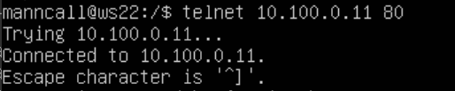

- Проверим соединение по TCP для DNAT: для этого с r1 подключитмся к серверу Apache на ws22 командой `telnet` (обращаемся по адресу r2 и порту 8080). \
  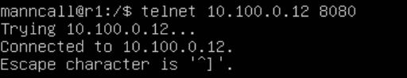


## Part 8. Дополнительно. Знакомство с SSH Tunnels

- Запуститм на r2 фаервол с правилами из Части 7
  
  - Файл фаервола на r2: (за > 80) \
  

  - Запустим файл командами: `chmod +x /etc/firewall.sh` и `/etc/firewall.sh` \
  


- Запустим веб-сервер Apache на ws22 только на localhost (то есть в файле /etc/apache2/ports.conf изменим строку Listen 80 на Listen localhost:80).

  - Изменения в файле /etc/apache2/ports.conf \
  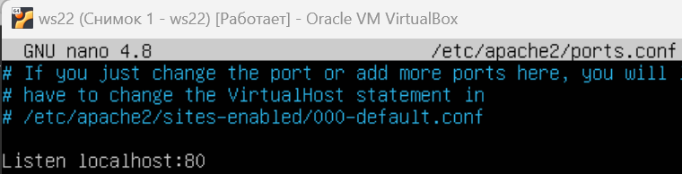

  - Перезагрузим apache2 командой `sudo systemctl restart apache2`: \
  

- Воспользуемся Local TCP forwarding с ws21 до ws22, чтобы получить доступ к веб-серверу на ws22 с ws21.

  - На ws21 введем команду `ssh -L 9999:localhost:80 10.20.0.20` \
  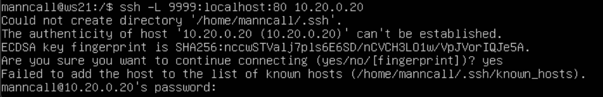

  - Скрин с полученым доступом к ws22 с ws21 \
  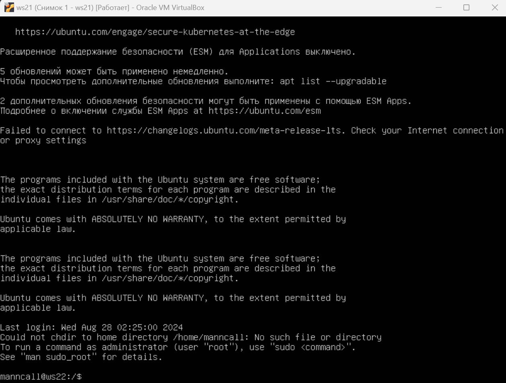

- Воспользуйся Remote TCP forwarding c ws11 до ws22, чтобы получить доступ к веб-серверу на ws22 с ws11.

  - На **ws22** введем команду `ssh -R 8888:localhost:80 10.10.0.2` \
  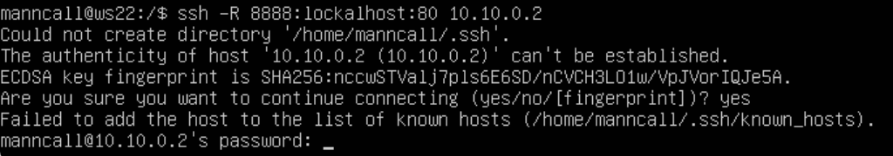

  - Скрин с полученым доступом \
  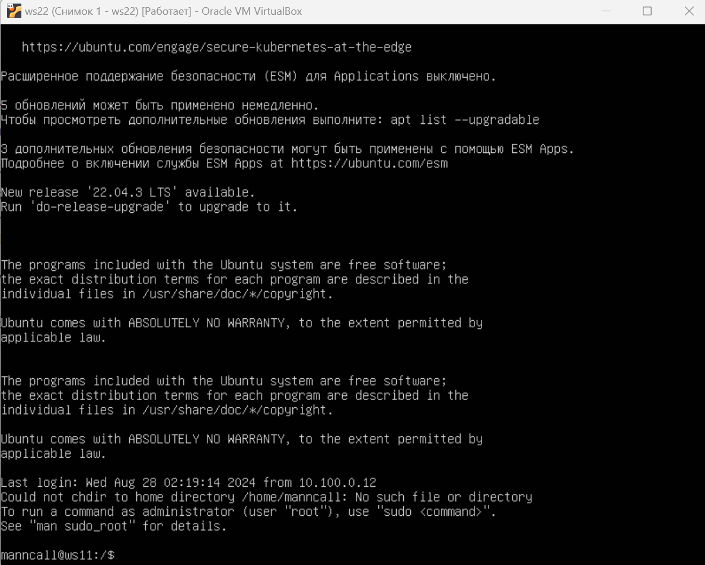

- Для проверки, сработало ли подключение в обоих предыдущих пунктах, перейди во второй терминал (например, клавишами Alt + F2) и выполни команду: `telnet 127.0.0.1 [локальный порт]` 
   - Для ws21 проверяем `telnet 127.0.0.1 9999` \
     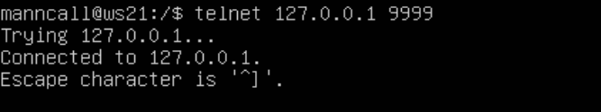
    
  - Для ws11 проверяем `telnet 127.0.0.1 8888` \
     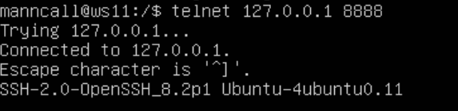
    
- Делаем дампы образов машин
